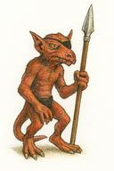

```markdown
# El Kobold Tuerto

**https://koboldweb.pages.dev/**

---

Este es un homenaje a uno de los sitios más misteriosos y minimalistas de los primeros años del Internet argentino.

## 🕸️ ¿Qué era el Kobold Tuerto?

Nadie sabe con certeza.

Allá por 2001 o 2002, alguien registró el dominio `kobold.com.ar`. Lo único que mostraba era:

```html
<h1>Esta página se encuentra en construcción.</h1>
<center></center>
```

Y una imagen que hoy está perdida en el tiempo: el logo del Kobold Tuerto — un kobold al estilo Dungeons & Dragons, con un báculo o lanza, y un parche en el ojo. Probablemente dibujado a mano, escaneado, con contrastes a tope. Nunca sabremos si fue digital o analógico. Nunca sabremos por qué.

Tal vez era un sitio de una crew de jugadores de Magic. Tal vez un dominio reservado para litigar después. Tal vez nada. Lo único cierto es que el sitio estuvo **en construcción durante años**, hasta que el dominio expiró o fue comprado por una empresa alrededor de 2007. Y así desapareció el Kobold Tuerto.

## 🔁 ¿Por qué revivirlo?

Porque *alguien tenía que hacerlo*.

Este sitio es una recreación respetuosa, simple y fiel al espíritu original: un eterno sitio en construcción. Y esta vez, el kobold volvió a la web... aunque sea en un subdominio.

## 🧙‍♂️ Tecnología

- HTML puro, como en los viejos tiempos
- Cloudflare Pages
- Un solo archivo `.jpg` para el logo (recreado a mano por IA)
- Nada de frameworks. Nada de JS. Solo nostalgia.

---

> “La web es un cementerio de intenciones. Este es uno de sus fantasmas.”  
> — alguien en IRC, probablemente
